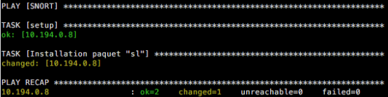

# ANSIBLE installation


Ansible is a simple IT automation engine that automates cloud provisioning, configuration management, application deployment, intra-service orchestration, and many other IT needs.  
*ansible.com*  

<center></center>
## Aim of the document

  Here we are going to deploy and test a basic ANSIBLE installation. It mean installation from the depository, configuration and test on a remote host. We also create our first basic playbook.

## Summary
1 - [Principe](#principe)  
1.1 - [Playbooks](#playbooks)  
2 - [Infrastructure](#infrastructure)    
3 - [Installation](#installation)  
3.1 - [Before we start](#before-we-start)  
3.2 - [Download from repository](#download-from-repository)   
3.3 - [Remote hosts configuration](#remote-hosts-configuration)  
3.4 - [Paquets installation](#paquets-installation)    
3.5 - [Configuration](#configuration)   
3.6 - [Connection via ssh-key](#Connection via ssh-key)      
3.6.1 - [Generating an ssh-key](#generating-an-ssh-key)   
4 - [Host file configuration](#host-file-configuration)    
5 - [Launching the playbook](#launching-the-playbook)  
6 - [TODO](#todo)  


## Principe

Written in python it permit the configuration of remote hosts like you used to do with bash scripts, but way better.
Ansible can handle all the errors and you can create pattern depending of the error returned by the remote host. Better, the same book can be played multiple time without harming the system or the previously installed playbook.

### Playbooks

It's the name given to the codes name written in ansible. They centralize all the roles, actions and variables used for the services installation on remote hosts. You want them to be the less specific possible to be compliant with as many system as possible.
The language used in playbook is '.yaml', witch is just an optimised XML.

## Infrastructure
We choosed here to install the ansible service in a dedicated virtual machine but you can just use your personal computer as ansible server, while you still have access to the deployment server.

Below, the schematic diagram.


## Installation

**WARNING**: This tutorial is designed for Ubuntu 16.04 TLS (both ansible server and remote hosts), you may need to adapt to your system needs.
### Before we start

Be sure to have a system up-to-date and to be root (at least sudo):
```bash
sudo apt-get update
sudo apt-get upgrade
```
### Download from repository
Since ansible is on the ubuntu repository we juste have to:
```
sudo apt-get install -y ansible
```
That's all. Your ansible server is ready !

### Remote hosts configuration

For ansible to work on remote hosts they need:
- an SSH port listening
- allow root (or a sudo user) connection
- python 2.7 installed
- internet connectivity (you can deploy playbooks with all the packets embeded but its not reviewed here).

We assume a root user exist on the host and you know his password.

#### Paquets installation
SSH server and installation. As everything else on Ubuntu, its quite easy:
```
sudo apt-get install -y python openssh-server
```

#### Configuration
As sudo open the file **/etc/ssh/ssd_config** and uncomment the line :  
 **PermitRootLogin yes**
Repeat the configuration for each remote hosts who will receive playbooks frome the ansible server.

You are almost all setup.

#### Connection via ssh-key
The use of password can be tricky using playbooks (you need to write them in clear-text or enter them during the installation). So we are going to use ssh-key.

##### Generating an ssh-key
By default the command is :
``` ssh-keygen ``` but you may want a little more security than the basic.  
We create a 8192 bits rsa key.
```
ssh-keygen -t rsa -b 8192
```
Follow the steps, you can use a passphrase to protect the key but it will slow you during the deployement process.

Know copy the key to all remote hosts:
```
ssh-copy-id root@<host-ip>
```

When done you can replace the PermitRootLogin :
Before :  
```PermitRootLogin yes ```  
Now:  
```PermitRootLogin no```

Then restart the service :  
``` service ssh restart ```

## Configuration test

The simpliest way to test the link between the ansible server and a remote host is the ping ansible command.
```
ansible <ip-host> -u root -m ping
```
If the communication is successfull you should see something like :
```ansible
   10.194.0.8 | SUCCESS => {
     "changed": false,
     "ping": "pong"
   }
```     

### Host file configuration


 This file in ```/etc/ansible/hosts``` of the ansible server concentrate all the remote hosts.
 Configuration example:  
 ```
[ClusterName]
<ip-host-1>
<ip-host-2>
<ip-host-3>

[WebServers]
<ip-host-1>
<ip-host-2>

[ReverseProxy]
<ip-host-1>
<ip-host-3>
 ```
 This is just an example. You can create as much cluster as you want and adapt to your needs.

To ping all the host of a cluster simply use:  
``` ansible WebServers -u root -m ping ```  
And if you want to ping all the hosts:  
``` ansible all -u root -m ping ```  

## First playbook

**WARNING**: Syntax is very important, you must respect it.
- '---' start the YAML file
- 'hosts' is the cluster name
- 'name' is only for the visual effect during the installation
- 'apt' is an ansible built-in command
C
reate a file named ```first.yml```.

```
---
- hosts: WebServers
  remote_user: root
  tasks:
    - name: 'sl' packet install
      apt: name=sl update_cache=yes
```

### Launching the playbook
To execute it do:  
```anbile-playbook first.yml```
You should see something like this:



## TODO
In an hypothetic future we should:
- Explain how to embed packets for internet-less deployement
- Explain how to create playbooks who handles connection by password or with a ssh-key passord.
- Create a script to deploy the ssh-key to each hosts


That's all folks !  
Thanks for reading,  
**Nodulaire**
