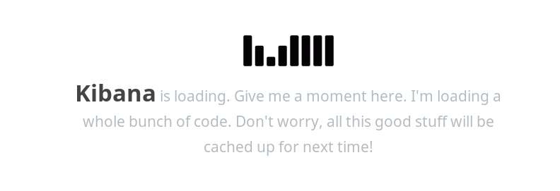
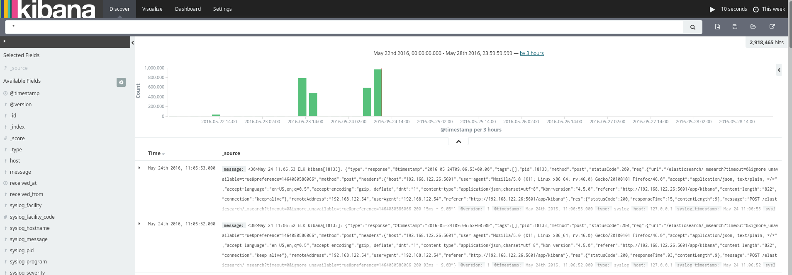
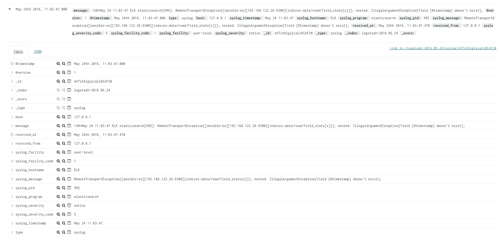

# Kibana

*Document Control*    

|  Date | Version  | Author  | Change/Addition  |
|---|---|---|---|
| 23/08/2016  | 1 | Nodulaire  |  Compliance  |

## Definition

"Kibana is an open source data visualization plugin for Elasticsearch. It provides visualization capabilities on top of the content indexed on an Elasticsearch cluster." Wikipedia.

Kibana is a visual plateforme coded in Java.

## Installation

The Installation of kibana is part of our ELK deployment playbook. It's not further brought up here.

## Dashboard

### Keep calm and wait
Depending on the hardware and connection you may have to wait a few minutes before to see anything interesting. Spam F5 will not help.

### Discover panel
  

A lot of information here. You can see on the left bar:
- The selected fields of the current research ('\*' mean everything).
- The fields available for search purpose

On the center:
- A bar diagram of log occurrence during the last week
- The last raw logs logged.

You can expand the logs to see further with the arrow on the left of the timestamp:

We can see all the information extracted by logstash from a rsyslog log (in standard log format **rfc 5424**)

That's all folks !  
Thanks for reading,  
**Nodulaire**
