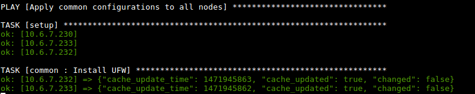

# ELK-Ansible  

*Document Control*    

|  Date | Version  | Author  | Change/Addition  |
|---|---|---|---|
| 22/08/2016  |1 | Renaud PULIDO  |  Creation |


## AIM

Monitoring should be for everyone. Not only those with money or skills.   
Here we provide a monitoring plateform, **universal and easy to use**.

Here you can find :
 - ANSIBLE scripts (automatisation of the installation).
 - Logstash configuration files (Groks and patterns).
 - Elasticsearch cluster configuration files.
 - Kibana dashboards (exemples purpose).
 - RSyslog remote client configurations.
 - Plugins exemples for the log forwarding (Web, VPN, ...).

## Summary
1 - [Quick-start](#Quick-start)  
1.1 - [Requirement](#Requirement)  
1.2 - [Quick-launch](#Quick-launch)  
2 - [Documentation](#Documentation)  
3 - [Anouncement](#announcement)  
4 - [Contact](#contact)  


## Quick-start
### Requirement
You need *ansible* installed on your computer and a remote server ubuntu 16.04 LTS (accessible by ssh) with sudo access and python2.7 installed.
For further instruction, read the documention **[Ansible-install.md]**(../Documentation/Installation/Ansible-Install.md).

### Quick-launch

Install the playbook :
```
git clone https://github.com/Nodulaire/ELK-Ansible && cd ELK-Ansible/Playbooks
```

Edit the configuration file **[hosts](Playbooks/hosts)** and modify to match your hosts.
Next, modify the configuration file **[site.yml](Playbooks/site.yml)** to match your needs.

A detailed exemple is available in **[COI-ConfigurationAndOperationInstruction.md](Documentation/Configuration/COI-ConfigurationAndOperationInstruction.md)**

Eventually, launch the playbook:
```
ansible-playbook site.yml -i hosts  --private-key /your/path/to/private/key  -v
```
You should see something like this :  


## Documentation

For further information you can see our guides in the *[Documentation](Documentation)* section.
```
.
├── Configuration
│   └── COI-ConfigurationAndOperationInstruction.md   <-- Configuration tutorial
├── Images
├── Information
│   ├── Elasticsearch-Info.md
│   ├── Kibana-Info.md
│   ├── Logstash-Info.md
│   ├── TSD-TechnicalServiceDescription.md            <-- Technical description of our product
│   └── Workflow-info.md                              <-- if you want to collaborate
├── Installation
│   ├── Ansible-Install.md
│   ├── ELK-Stack-Deployment.md
│   └── INM-InstallationManual.md                     <-- main installation guide
└── README.md                                         <-- summary
```

For the hardware and network requirement see: [inm](Documentation/Installation/INM-InstallationManual.md).  

## Anouncement
The project isn't ready yet. There is a lot of work left to do. Feel free to join us in our creation !


## Contact
Feel free to contact us at any time.

| Role | Pseudonyme | Name | Contact | PGP Key signature |
|-------|---|---|--------|-------------------|
|Project architect | Nodulaire | **Renaud PULIDO**  | renaud.pulido@gmail.com | 144CFD9A |
|Project developer | Boboo   |**Boris ROMANOW**  | boris.romanow@gmail.com | 2185AF59 |


---
That's all folks !  
Thanks for reading,  
**Nodulaire**
