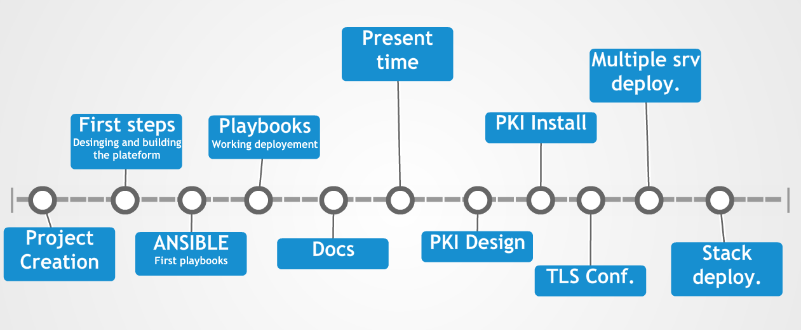

# ELK-Ansible

## AIM

Monitoring should be for everyone. Not only those with money or skills.   
Here we provide a monitoring plateform, **universal and easy to use**.

Here you are going to find :
 - ANSIBLE scripts (automatisation of the installation).
 - Logstash configuration files.
 - Elasticsearch configuration files.
 - Kibana dashboards (exemples purpose).
 - RSyslog configurations.
 - Plugins exemples for the log forwarding.

## Summary
1 - [Timeline](#timeline)  
2 - [Architecture](#architecture)  
2.1 - [Principe](#principe)  
2.2 - [Model installation](#model-installation)  
3 - [Pro/Con](#pro/con)  
3.1 - [Pro](#pro)  
3.2 - [Con](#con)  
4 - [Hardware requirement](#hardware-requirement)  
5 - [Anouncement](#announcement)  
6 - [Contact](#contact)  
7 - [TODO](#todo)  

## Timeline



## Architecture

### Principe
```
      ELK Stack Master                                  Legacy Syslog                               Client(s)
______________________________                     ______________________                     ______________________________   
|                            |                     |                     |                    |                            |  
|          KIBANA            |                     |                     |                    |          Web Logs          |  ___
|____________________________|                     |                     |                    |____________________________|    |
|                            |                     |    Proof sealing    |                    |                            |    |
|        ElasticSearch       |                     |                     |                    |        Systems Logs        |  __|
|____________________________|                     |_____________________|                    |____________________________|    |
|                            |                     |                     |                    |                            |    |
|         Logstash           |  <--------|         |                     |                    |        Kernel Logs         |  __|
|____________________________|           |         |                     |                    |____________________________|    |
|                            |           |         |    Local Syslog     |                    |                            |    |
|          Syslog            |  <--Client(s) Logs--|                     | <--Client(s) Logs--|        Local Syslog        |  <-/
|____________________________|         (TLS)       |_____________________|      (TLS)         |____________________________|  
```
 In our solution all the clients send their logs (via TLS) directly to a legacy syslog server, and the legace log server forward them to the ELK stack.  
 The proof sealing mecanism is a legal obligation in most of the europeean countries. 

### Model installation

There is the infrastructure we use to test our playbooks :


## Pro/Con

### Pro

- Agent less client configuration
- All log in the syslog standardized format
- No third party software to install on your servers
- Lightweight
- Compatible all Unix/Linux systems
- Integrity granted (TLS)

### Con
- Limited to  the supported rsyslog format
- Specific logs input may need custom groks

## Hardware requirement
For this first version we are configuring the whole stack into a single (virtual) server. We will script multiple instance/cluster in a second time.


- ELK Stack server (all services: Elasticsearch Logstash and Kibana)
      - OS  : Ubuntu Xenial 16.04 LTS
      - RAM : 4Go
      - CPU : 2
      - Oth : SSH Root access and [python 2.7](http://docs.ansible.com/ansible/faq.html#how-do-i-handle-python-pathing-not-having-a-python-2-x-in-usr-bin-python-on-a-remote-machine) (not installed by default) and an internet connection.  

- Ansible server
      - RAM : 128Mo or more
      - OS  : Whatever who support SSH
      - Oth : Python 2.7


## Anouncement
The project isn't ready yet. There is a lot of work left to do. Feel free to join us in our creation !


## Contact
This project is made on our spare time be free to contact us at any time.

| Role | Name | Contact | PGP Key signature |
|-------|------|--------|-------------------|
|Project architect | **Renaud PULIDO**  | renaud.pulido@gmail.com | 144CFD9A |
|Project developer | **Boris ROMANOW**  | boris.romanow@gmail.com | 2185AF59 |


### TODO :
- Provide a docker container per services (not a priority now {25/04/2016})
- Provide hardware requirement for each stack elements and a few performance test.
- Make a bug tracker
